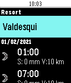
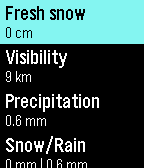

# Slope Buddy

Watch app for ski resort forecast

## Configuration:

Go to [weatherunlocked.com](developer.weatherunlocked.com) and register for an account, you should have a key ready of type `Ski Resort Free Plan` ready to use. Select a ski resort of your choice, copy over the App ID, App Key and the Resort ID (Number next to name!) over to your phone, paste it in the Pebble app configuration page.

## Watch app:

| Main screen                                           | Detailed view                                         |
| ----------------------------------------------------- | ----------------------------------------------------- |
|  |  |

## Supported watches:

-   Pebble Classic (untested)
-   Pebble Steel
-   Pebble Time
-   Pebble Time Steel
-   Pebble Time Round (untested)
-   Pebble 2

# To-do:

-   [x] Timeline support: push next day to timeline
-   [ ] Glances: push next hour to glance (let user select which data to push)
-   [x] Select between imperial and metric (metric is now hard coded)
-   [X] Look for API which serves Lift status (liftie.info ?)
-   [x] Testing with Pebble Steel and Pebble Time 2

## Icons

Icons by [weatherunlocked.com](developer.weatherunlocked.com)
